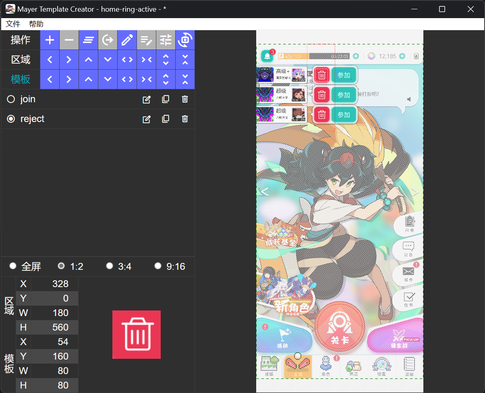
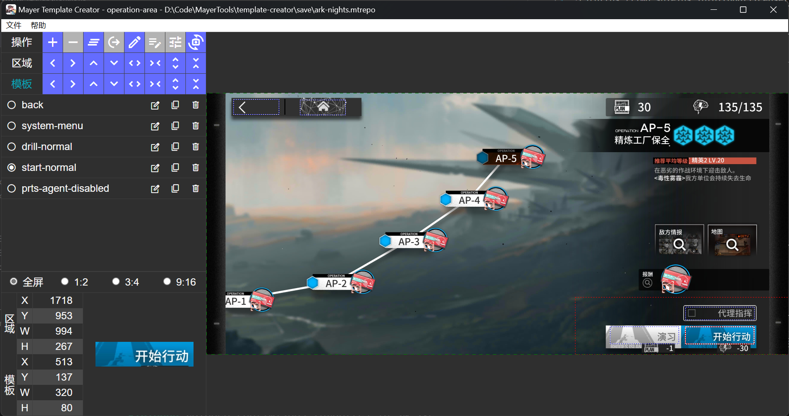

# Mayer Template Creator

本项目是一个基于 [Tauri](https://tauri.app) 的应用，用于创建供游戏脚本使用的识图模板。

## 亮点功能

* **模板**和**热区**，减少识别开销
* **热区锚点**，适应不同屏幕分辨率
* 可保存**工程文件**，和别人分享你的切图工程（使用 protobuf 构建）
* 模板可导出至各脚本使用
* 夜间模式

## 截图示例

<figcaption>世界弹射物语</figcaption>

<figcaption>明日方舟</figcaption>

## 适用的游戏脚本框架

* [Mayer](https://github.com/pboymt/Mayer)
* [MaaAssistantArknights](https://github.com/MaaAssistantArknights/MaaAssistantArknights) *导出开发中*
* 其他（可添加导出支持）

## 下载地址

目前项目处于预览状态，功能会随时发生变化，请前往 [Release](./tags "无正式发行版") 下载最新的构建。

## 目前还未解决的问题

* [ ] Cavas 性能与内存占用问题，内存爆炸的情况十分随机，原因未知，虽然做了分层渲染，但是并未做离屏渲染的处理等 [MDN](https://developer.mozilla.org/zh-CN/docs/Web/API/Canvas_API/Tutorial/Optimizing_canvas) 推荐的优化。
* [ ] 多项目编辑，计划内存爆炸的问题解决后添加。
* [ ] 兼容多脚本框架的导出系统。
